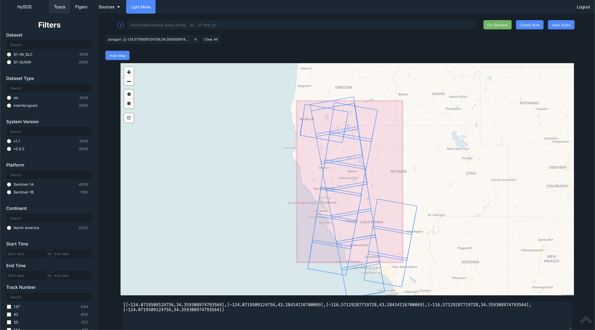

## Pre-Requisites

- Node (>=6 & < 13) installed on machine
- npm installed

## Create config file

```bash
# create config file (if developing locally)
cp src/config/index.local-development.template.js src/config/index.js
```

set your Elasticsearch host:port + indices/aliases

```js
// config/index.js
exports.GRQ_ES_URL = "http://localhost:9200";
exports.GRQ_ES_INDICES = "grq";
.
.
.
exports.MOZART_ES_URL = "http://localhost:9998";
exports.MOZART_ES_INDICES = "job_status";
```

## Creating Tosca + Figaro config file(s)

both the `figaro` and `tosca` views in `hysds_ui` have their own configuration files to customize what the end users can see

- filters in the sidebar
- fields returned from `elasticsearch`
- columns in the table view

you can copy it straight to `src/config` or `symlink` it from another directory

```bash
cp src/config/figaro.template.js src/config/figaro.js
cp src/config/tosca.template.js src/config/tosca.js
```

<b>NOTE:</b> when adding a new filter to the sidebar make sure to add it (`componentId`) to both `exports.FILTERS` and `exports.QUERY_LOGIC`:

```js
// config/figaro.js or config/tosca.js

exports.FILTERS = [
  ...
  {
    componentId: "foo",
    dataField: "foo.keyword",
    title: "foo",
    type: "single",
  },
  ...
];

exports.QUERY_LOGIC = {
  and: [
    ...
    "foo",
    ...
  ],
};
```

## Building and Running application locally

```bash
# install nodejs dependencies
npm install

# builds and compiles to dist/index.js
npm run build

# run application in development mode with hot-reloading
npm start

# run application in "production mode"
npm run prod
```

## Dockerizing React Application

- uses nginx as a webserver to serve application as a static file

```bash
# Building the docker image
docker build . -t hysds_ui:latest

# Running image
docker run -p 8080:80 hysds_ui:latest
```


